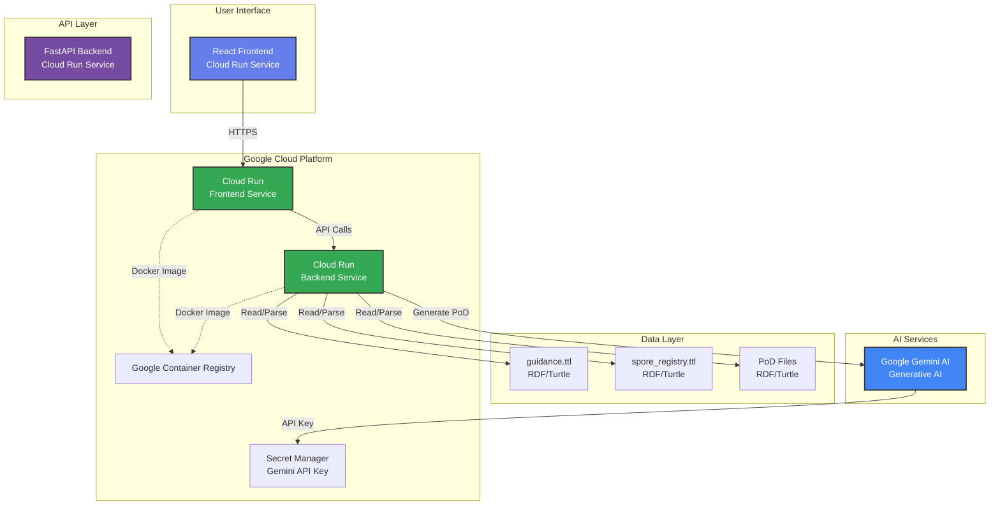

# Architecture Diagram

## System Architecture



## Technology Stack

### Frontend
- **Framework**: React 18.2
- **HTTP Client**: Axios
- **Web Server**: Nginx (Alpine)
- **Container**: Docker
- **Deployment**: Google Cloud Run

### Backend
- **Framework**: FastAPI (Python 3.11)
- **RDF Processing**: RDFLib
- **AI Integration**: Google Generative AI (Gemini)
- **Container**: Docker
- **Deployment**: Google Cloud Run

### Data Storage
- **Format**: RDF/Turtle (.ttl files)
- **Ontology**: Custom ontology for Plans of Day and Spores
- **Storage**: File-based (included in container)

### Cloud Services
- **Compute**: Google Cloud Run (serverless containers)
- **Container Registry**: Google Container Registry
- **Secrets**: Google Secret Manager (for Gemini API key)
- **AI**: Google Gemini Pro (via Generative AI API)

## Request Flow

1. **User accesses frontend** → Cloud Run serves React app
2. **User views PoD/Spore data** → Frontend calls backend API
3. **Backend parses RDF files** → Returns structured JSON
4. **User generates new PoD** → Frontend sends prompt to backend
5. **Backend calls Gemini AI** → Generates structured PoD
6. **Response returned** → Frontend displays generated PoD

## Deployment Architecture

```
┌─────────────────────────────────────────────────────────┐
│                    Google Cloud Run                      │
├─────────────────────────────────────────────────────────┤
│                                                          │
│  ┌──────────────────┐         ┌──────────────────┐     │
│  │  Frontend        │         │  Backend         │     │
│  │  Service         │────────▶│  Service         │     │
│  │  (Port 80)       │  HTTPS  │  (Port 8080)     │     │
│  │                  │         │                  │     │
│  │  - React App     │         │  - FastAPI       │     │
│  │  - Nginx         │         │  - RDFLib        │     │
│  │  - Static Files  │         │  - Gemini AI     │     │
│  └──────────────────┘         └──────────────────┘     │
│                                                          │
└─────────────────────────────────────────────────────────┘
                            │
                            ▼
                   ┌──────────────────┐
                   │  Gemini AI API   │
                   │  (External)      │
                   └──────────────────┘
```

## Key Features

1. **Multi-Service Architecture**: Separate frontend and backend services on Cloud Run
2. **AI-Powered Generation**: Uses Google Gemini AI for intelligent PoD creation
3. **RDF-Based Ontology**: Leverages semantic web standards for structured data
4. **Serverless & Scalable**: Cloud Run automatically scales based on traffic
5. **Containerized**: Both services run in Docker containers


