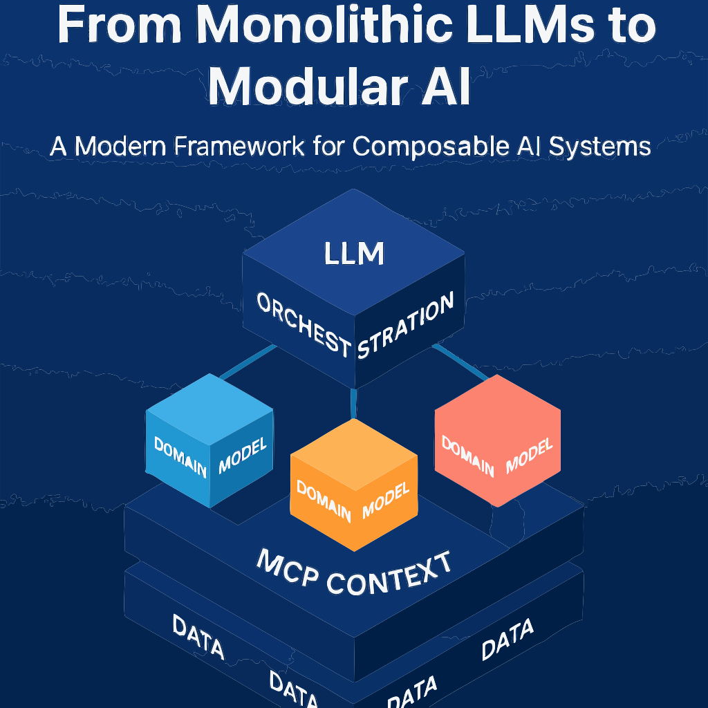
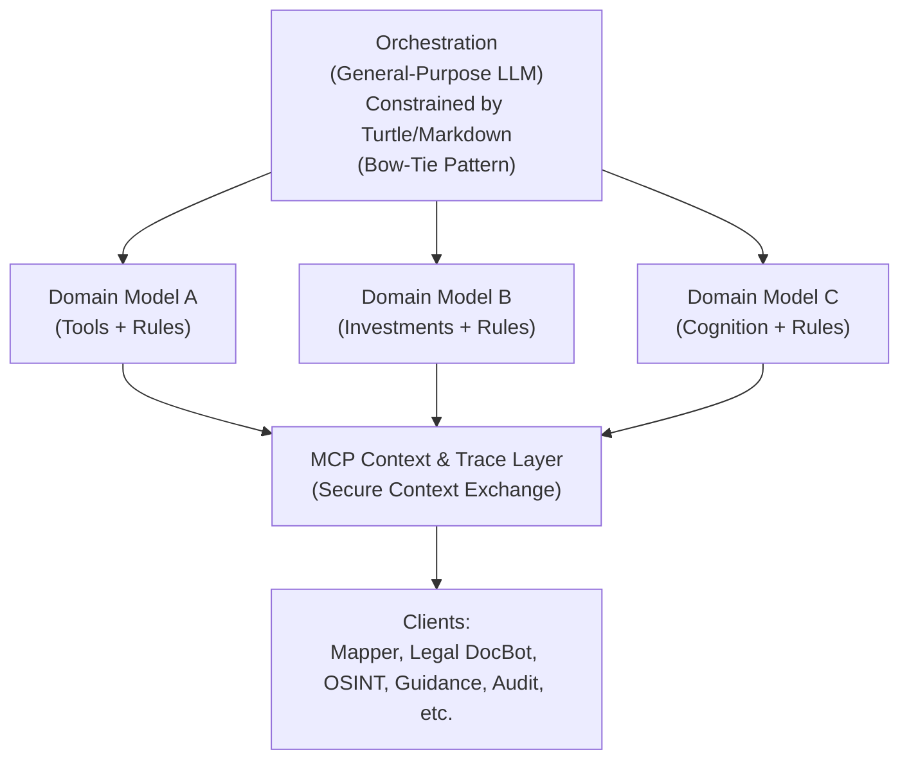
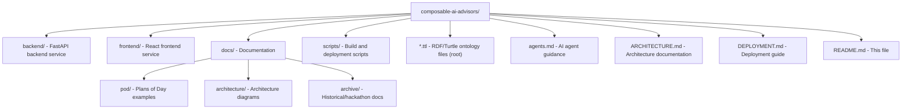

# Composable AI Advisors

A multi-agent mesh architecture system that decomposes general AI into a service-mesh of specialized reasoning engines, orchestrated by a model-driven orchestrator with secure context exchange via MCP (Model Context Protocol).

## Overview

**Composable AI Advisors** uses a multi-agent mesh pattern where:

- An **orchestrator** (general-purpose LLM constrained by models) decomposes tasks and coordinates specialists
- **Domain models** are static, machine-readable model descriptions (Turtle/JSON/Markdown) that LLMs use to assume stakeholder positions
- **MCP Context & Trace layer** provides secure context exchange, provenance, and audit
- **Client applications** consume orchestrated outputs

The system implements **three bow-tie patterns**:

1. **Architectural Bow-Tie**: Many domain models → Constrained orchestrator → Many client applications
2. **Orchestrator Internal Bow-Tie**: General-purpose LLM → Constrained by models (Turtle/Markdown) → Model-driven behavior
3. **Domain Model Internal Bow-Tie**: General-purpose/for-purpose LLM → Constrained by models → Domain-specific behavior

## Core Architecture



*From Monolithic LLMs to Modular AI - A Modern Framework for Composable AI Systems*



## Key Concepts

### Multi-Agent Mesh
- **Not a monolithic LLM**: System uses multiple specialized reasoning services
- **Orchestration**: General-purpose LLM constrained by models (bow-tie pattern) decomposes tasks and routes to specialists
- **Service Mesh**: Services use domain models to provide independent domain-specific capabilities (MaaS pattern)
- **Domain Models**: Static, machine-readable model descriptions of a domain (Turtle, JSON, or Markdown format)
  - Used by LLMs to assume the position of a stakeholder for that domain
  - Must be machine-readable since an LLM needs to read it
  - Format preference: Turtle > JSON > Markdown (Markdown is least preferred)
- **Current State**: Multi-genetic LLM advisory capabilities are working

### MCP (Model Context Protocol)
- **Purpose**: Secure protocol for context exchange between agents
- **Components**: Context, tools, metadata, traceability
- **Implementation**: Configuration in `.mcp/` directory (to be added)
- **Benefits**: Provenance tracking, audit trails, secure context sharing

### Spores
- **ContextSpore**: Portable context bundles for agent continuity
- **PromptSpore**: Reusable prompt logic packets
- **Purpose**: Maintain context across agent sessions and multi-agent workflows
- **Storage**: Tracked in `spore_registry.ttl` (RDF/Turtle)

### Ontologies (RDF/Turtle)
- **Format**: Semantic web standards (RDF/Turtle)
- **Purpose**: Structured, machine-readable, interoperable data
- **Files**: 
  - `caa-glossary.ttl` - Core CAA ontology
  - `guidance.ttl` - Guidance registry
  - `spore_registry.ttl` - Spore tracking
  - `docs/pod/` - Plans of Day examples

### Plans of Day (PoD)
- **Structure**: PDCA workflow (Plan-Do-Check-Act)
- **Format**: RDF/Turtle files
- **Purpose**: Structured daily planning with semantic relationships
- **AI Generation**: Uses Google Gemini AI for intelligent PoD creation

## Technology Stack

### Backend
- **Language**: Python 3.11
- **Framework**: FastAPI
- **RDF Processing**: RDFLib
- **AI Integration**: Google Gemini (Generative AI)
- **Deployment**: Google Cloud Run

### Frontend
- **Framework**: React 18.2
- **HTTP Client**: Axios
- **Web Server**: Nginx
- **Deployment**: Google Cloud Run

### Data & Protocols
- **Ontologies**: RDF/Turtle (.ttl files)
- **Context Protocol**: MCP (Model Context Protocol)
- **API Format**: JSON (RESTful)

### Infrastructure
- **Laboratory**: Public external endpoint at `observatory.niklon.com` (served through Cloudflare)
- **Multi-LLM Development**: Lab fully wired for multi-LLM development
- **Component Repositories**: Niklon organization repositories contain concrete, publicly available components
- **Package Management**: Several components available via PyPI
- **CI/CD**: SonarCloud-enabled CI/CD pipelines for component repositories

## Project Structure



**Configuration files** (hidden from view):
- `.cursor/` - Cursor IDE configuration and rules
- `.mcp/` - MCP configuration (to be added)
- `.cursorrules` - Main Cursor rules

## Getting Started

### Prerequisites

- Python 3.11+
- Node.js 18+
- Docker (for containerized deployment)
- Google Cloud Platform account (for Cloud Run deployment)
- Gemini API key (for AI features)

### Local Development

#### Backend

```bash
cd backend
pip install -r requirements.txt
export GEMINI_API_KEY=your-api-key-here
export PORT=8080
python main.py
```

The backend will be available at `http://localhost:8080`

#### Frontend

```bash
cd frontend
npm install
export REACT_APP_API_URL=http://localhost:8080
npm start
```

The frontend will be available at `http://localhost:3000`

### Deployment

See [DEPLOYMENT.md](./DEPLOYMENT.md) for detailed deployment instructions.

## Architecture Principles

1. **Multi-Agent Mesh**: Decompose general AI into a service-mesh of specialized reasoning engines
2. **MaaS (Models as a Service)**: Each specialist reasoner runs as its own service/API
3. **Orchestration**: General LLM coordinates domain-specific services
4. **Context Exchange**: Use MCP for secure context, tools, and traceability
5. **Ontology-Driven**: Use RDF/Turtle for structured, interoperable data

## Benefits of the Modular Pattern

- **Domain Accuracy**: Dedicated expert models reduce hallucinations and enforce domain logic
- **Personalization**: The context layer personalizes outputs per user and data source without retraining the general model
- **Governance**: Clear service boundaries make decisions auditable and explainable
- **Maintainability**: Independent upgrades per domain reduce time-to-change
- **Cost & Performance**: Right-size models and infrastructure by workload rather than one giant footprint

## Orchestration Logic

The orchestrator uses **three bow-tie patterns** (all are present):

1. **Architectural Bow-Tie**: Many domain models → Constrained orchestrator → Many client applications
   - This is the overall system architecture pattern
   
2. **Orchestrator Internal Bow-Tie**: General-purpose LLM → Constrained by models → Model-driven behavior
   - This is how the orchestrator itself works internally
   
3. **Domain Model/LLM Internal Bow-Tie**: Each participant LLM (general-purpose or for-purpose) → Constrained by models → Domain-specific behavior
   - Each domain model's LLM starts as a general-purpose or for-purpose LLM (e.g., coding-specific LLM for coding tasks)
   - Models constrain each LLM to conform to domain requirements
   - This is how each domain model's reasoning engine works internally

**Key Points**:
- **General-Purpose LLM**: The orchestrator is a general-purpose LLM
- **Model Constraint**: Models (RDF/Turtle or Markdown) constrain/whittle down the LLM's behavior
- **Model Sources**: Model can be RDF/Turtle files or Markdown documents
- **Perspective Evaluation**: Build model for orchestrator to properly evaluate different perspectives
- **Confidence Threshold**: Orchestrator must meet a confidence threshold (typically 90%)
- **"Heat"**: The confidence measure is based on how the orchestrator is constructed
- **Escalation**: If confidence < threshold, escalate to human agent

## Development Guidelines

### When Working on Backend
1. **API Endpoints**: Follow FastAPI patterns, use type hints
2. **RDF Processing**: Use RDFLib, respect namespace conventions
3. **AI Integration**: Google Gemini API for PoD generation
4. **Service Boundaries**: Design as independent, orchestrated service
5. **MCP Awareness**: Consider context exchange implications

### When Working on Frontend
1. **React Patterns**: Component-based, modern hooks
2. **API Integration**: Use Axios, handle async properly
3. **Data Visualization**: Display PoDs, Spores, relationships
4. **UI/UX**: Modern, responsive design
5. **State Management**: Consider context/state patterns

### When Working with Ontologies
1. **Namespace Usage**: Follow conventions in `caa-glossary.ttl`
2. **SHACL Shapes**: Use for validation when appropriate
3. **Relationships**: Maintain semantic links (prov:wasGeneratedBy, etc.)
4. **Provenance**: Track creation, modification, sources
5. **Consistency**: Keep ontology files aligned with code

## Documentation

- **[agents.md](./agents.md)** - Comprehensive AI agent guidance and development workflow
- **[ARCHITECTURE.md](./ARCHITECTURE.md)** - Detailed architecture diagrams and technology stack
- **[DEPLOYMENT.md](./DEPLOYMENT.md)** - Deployment instructions and configuration
- **[internal-lingo-cheatsheet.md](./internal-lingo-cheatsheet.md)** - Terminology glossary
- **[docs/BOOTSTRAP.md](./docs/BOOTSTRAP.md)** - Project bootstrap guide
- **[.cursorrules](./.cursorrules)** - Cursor IDE rules and guidelines
- **[.cursor/rules/](./.cursor/rules/)** - Modular rule sets (architecture, ontology, MCP, coding standards)

## Key Terminology

See [internal-lingo-cheatsheet.md](./internal-lingo-cheatsheet.md) for complete glossary. Quick reference:

- **LIM42**: Design-scaffolding workflow toolset
- **BFG9K**: Agent-orchestration framework (separate product/repo, not part of this architecture)
- **Spore/ContextSpore/PromptSpore**: Modular context/prompt packet
- **MCP**: Model Context Protocol
- **MaaS**: Models as a Service
- **Mesh**: Multi-agent service network
- **PoD**: Plan of Day (PDCA workflow)
- **PDCA**: Plan-Do-Check-Act cycle

## Contributing

When making changes:

1. **Check Architecture**: Ensure changes align with multi-agent mesh pattern
2. **Update Ontologies**: If adding new concepts, update relevant `.ttl` files
3. **Maintain MCP Compatibility**: Consider context exchange implications
4. **Preserve Spore Patterns**: Maintain context continuity mechanisms
5. **Document Changes**: Update relevant `.md` files

## Status

- **Current State**: Multi-genetic LLM advisory capabilities are working
- **Infrastructure**: Laboratory at `observatory.niklon.com` fully wired for multi-LLM development
- **MCP Integration**: Configuration pending (see `.mcp/README.md`)
- **Tool Adapters**: Requirements for product delivery being determined

## License

See [LICENSE](./LICENSE) file for details.

## Related Projects

- **Niklon Organization Repositories**: Concrete, publicly available components (some on PyPI, SonarCloud CI/CD)
- **Graph RAG Chat Application**: Related work on Graph RAG patterns with GraphDB and SPARQL

---

**Built with ❤️ by BeastMost Systems / nkllon observatory**
