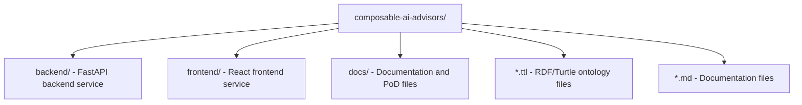
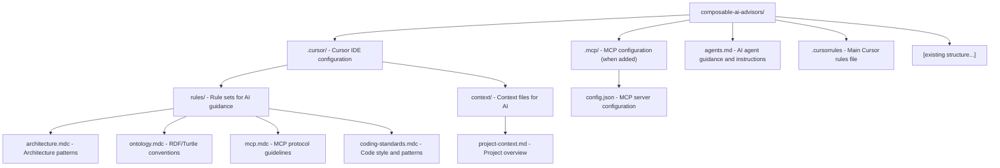

# Project Bootstrap Guide

## Overview

This document outlines the recommended structure and setup for AI-assisted development of the **Composable AI Advisors** project. This project uses a multi-agent mesh architecture with MCP (Model Context Protocol) for spec-driven development.

## Directory Structure Review

### Current Structure ✅

The current directory structure is well-organized:

### Recommended Additions

## Key Files to Create

### 1. `.cursorrules` (Root Level)
Main entry point for Cursor AI. This file should:
- Reference the project architecture
- Point to specialized rule files in `.cursor/rules/`
- Define high-level development principles
- Reference MCP integration points

### 2. `agents.md` (Root Level)
Comprehensive guide for AI agents working on this project:
- Project purpose and architecture
- Key terminology (from `internal-lingo-cheatsheet.md`)
- Development workflow
- MCP integration guidelines
- Common patterns and anti-patterns

### 3. `.cursor/rules/*.mdc` Files
Modular rule sets:
- **architecture.mdc**: Multi-agent mesh patterns, service boundaries
- **ontology.mdc**: RDF/Turtle conventions, namespace usage
- **mcp.mdc**: MCP protocol implementation guidelines
- **coding-standards.mdc**: Language-specific standards (Python, JavaScript)

### 4. `.cursor/context/project-context.md`
Structured project context for AI:
- Current state of the project
- Active development areas
- Known issues and TODOs
- Integration points

## MCP Integration

When you add MCP configuration, it should include:

1. **MCP Server Definitions**: Each domain model/service
2. **Context Exchange Protocols**: How agents share context
3. **Tool Adapters**: Connection points for domain-specific tools
4. **Trace/Provenance**: Audit trail configuration

## Development Workflow

### For AI Assistants

1. **Read Context First**: Always check `agents.md` and `.cursorrules`
2. **Follow Architecture**: Reference `.cursor/rules/architecture.mdc`
3. **Respect Ontologies**: Use RDF/Turtle conventions from `ontology.mdc`
4. **MCP Awareness**: Understand context exchange via MCP
5. **Spore Management**: Follow spore patterns for context continuity

### Key Principles

- **Modularity**: Each component should be independently deployable
- **Ontology-Driven**: Use RDF/Turtle for structured data
- **MCP-First**: Context exchange via MCP protocol
- **Multi-Agent**: Design for orchestration, not monoliths
- **Traceability**: Maintain provenance and audit trails

## Next Steps

1. ✅ Review this bootstrap guide
2. ⏳ Create `.cursorrules` file
3. ⏳ Create `agents.md` file
4. ⏳ Set up `.cursor/rules/` directory structure
5. ⏳ Add MCP configuration when ready
6. ⏳ Update README.md to reflect actual project purpose

## Notes

- The current README.md is hackathon-focused and should be updated
- MCP configuration will be added separately
- Rule files use `.mdc` extension (Model Context files)
- Keep rules modular and focused on specific concerns

