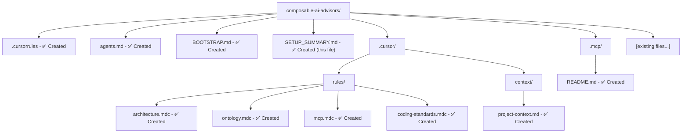

# Setup Summary - AI-Assisted Development Bootstrap

## What Was Created

### Core Configuration Files

1. **`.cursorrules`** (Root)
   - Main entry point for Cursor AI
   - High-level project overview and principles
   - References to specialized rule files
   - Key terminology and development guidelines

2. **`agents.md`** (Root)
   - Comprehensive guide for AI agents
   - Architecture overview with diagrams
   - Development workflow instructions
   - Common patterns and anti-patterns
   - Technology stack details

3. **`BOOTSTRAP.md`** (Root)
   - Directory structure review
   - Recommendations for additions
   - Development workflow
   - Next steps checklist

### Cursor Rules Directory (`.cursor/rules/`)

4. **`architecture.mdc`**
   - Multi-agent mesh patterns
   - Service design principles
   - Anti-patterns to avoid
   - Implementation guidelines

5. **`ontology.mdc`**
   - RDF/Turtle conventions
   - Namespace usage
   - File structure patterns
   - Provenance tracking

6. **`mcp.mdc`**
   - MCP protocol guidelines
   - Context exchange patterns
   - Tool adapter patterns
   - Traceability requirements

7. **`coding-standards.mdc`**
   - Python/FastAPI standards
   - JavaScript/React patterns
   - RDF/Turtle formatting
   - General coding principles

### Context Directory (`.cursor/context/`)

8. **`project-context.md`**
   - Current project state
   - Known issues
   - Development priorities
   - Integration points

### MCP Directory (`.mcp/`)

9. **`README.md`**
   - Placeholder for MCP configuration
   - Planned structure
   - Implementation notes

## Directory Structure

## Recommendations

### ✅ Completed
- [x] Created `.cursorrules` file
- [x] Created `agents.md` comprehensive guide
- [x] Set up `.cursor/rules/` directory structure
- [x] Created modular rule files (`.mdc` format)
- [x] Created project context file
- [x] Set up `.mcp/` directory placeholder

### ⏳ Next Steps (For You)

1. **Review Files**
   - Review `.cursorrules` and `agents.md`
   - Check rule files in `.cursor/rules/`
   - Adjust content to match your specific needs

2. **Add MCP Configuration**
   - When ready, add MCP server definitions
   - Configure context exchange protocols
   - Set up tool adapters

3. **Update README.md**
   - Replace hackathon-focused content
   - Add actual project purpose and architecture
   - Reference new documentation files

4. **Customize Rules**
   - Adjust `.cursor/rules/*.mdc` files as needed
   - Add project-specific patterns
   - Update coding standards if different

5. **Add Project-Specific Context**
   - Update `.cursor/context/project-context.md` with current state
   - Add known issues and priorities
   - Document integration points

## How AI Assistants Will Use This

### When Starting Work
1. Read `.cursorrules` for high-level guidance
2. Check `agents.md` for detailed instructions
3. Review relevant `.cursor/rules/*.mdc` files
4. Check `.cursor/context/project-context.md` for current state

### When Making Changes
1. Follow architecture patterns from `architecture.mdc`
2. Use ontology conventions from `ontology.mdc`
3. Consider MCP implications from `mcp.mdc`
4. Follow coding standards from `coding-standards.mdc`

### When Adding Features
1. Check if it fits multi-agent mesh pattern
2. Consider MCP integration requirements
3. Update ontologies if adding new concepts
4. Maintain service boundaries

## File Format Notes

- **`.mdc` files**: Model Context files for modular rule sets
- **`.md` files**: Standard Markdown documentation
- **`.cursorrules`**: Main Cursor configuration (no extension)

## Integration with MCP

When you add MCP configuration:
- Place configuration in `.mcp/` directory
- Reference MCP setup in `agents.md`
- Update `mcp.mdc` with specific patterns
- Add MCP context to `project-context.md`

## Customization

Feel free to:
- Modify rule files to match your preferences
- Add more rule files for specific concerns
- Update terminology to match your team
- Adjust coding standards to your style guide
- Add project-specific patterns

## Questions or Issues?

- Check `BOOTSTRAP.md` for structure recommendations
- Review `agents.md` for development workflow
- See `.cursor/rules/*.mdc` for specific guidelines
- Update `project-context.md` with current state

---

**Status**: ✅ Bootstrap complete - Ready for customization and MCP integration

