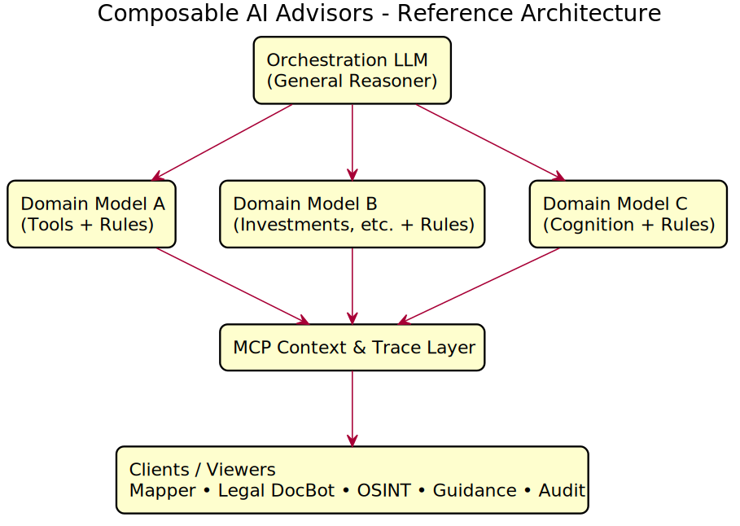
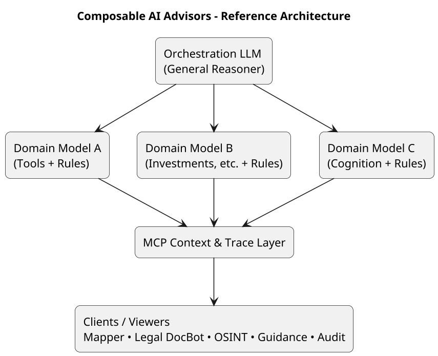
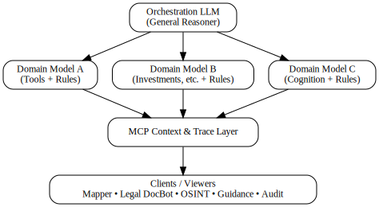
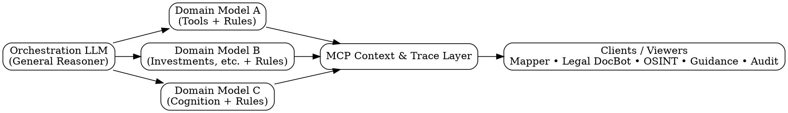

## Composable AI Advisors – Architecture Diagrams

This document wraps the PlantUML and Graphviz sources with inline renderings for easy viewing on GitHub.

### PlantUML

Source: `docs/architecture/composable-ai-advisors-architecture.puml`

Rendered:

For reference, the source is included below:

### Graphviz (DOT)

Source: `docs/architecture/composable-ai-advisors-architecture.dot`

Rendered:

For reference, the source is included below:

